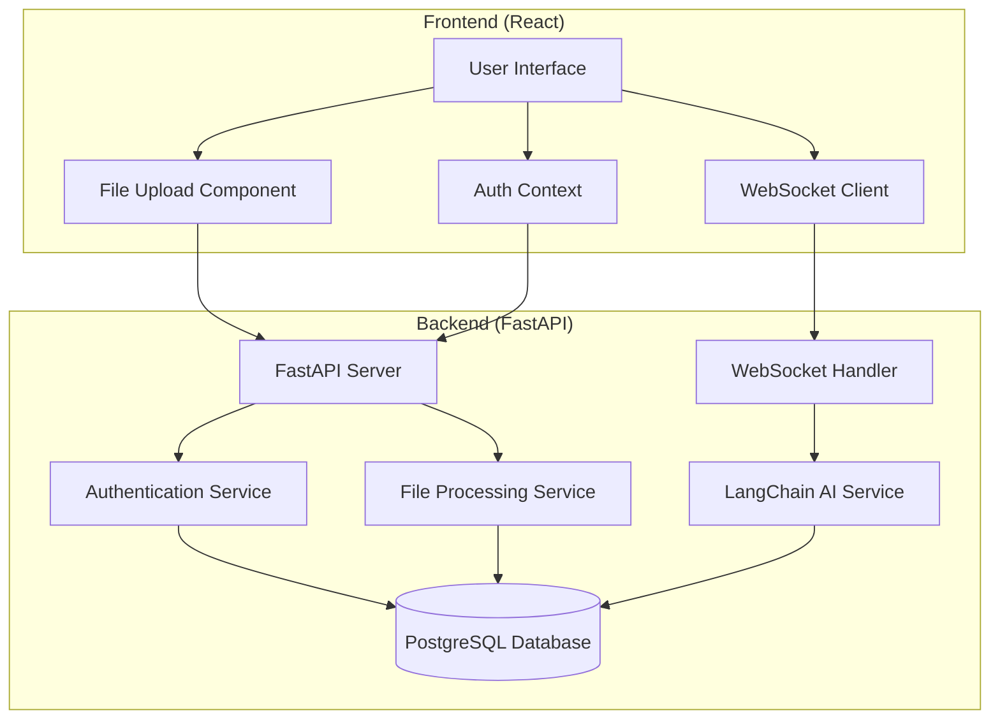
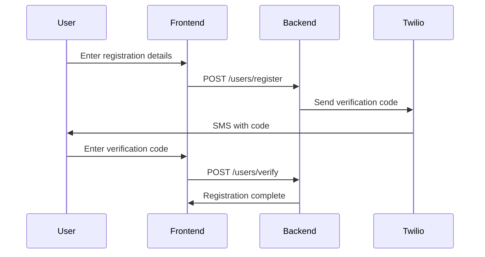
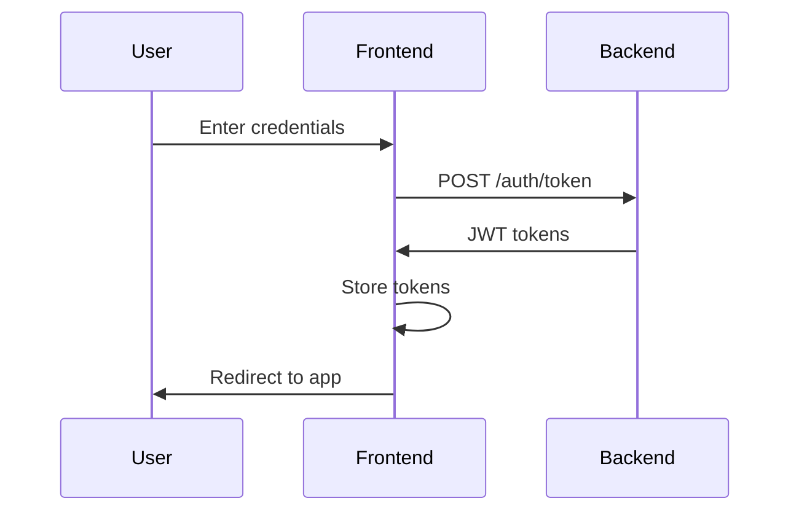
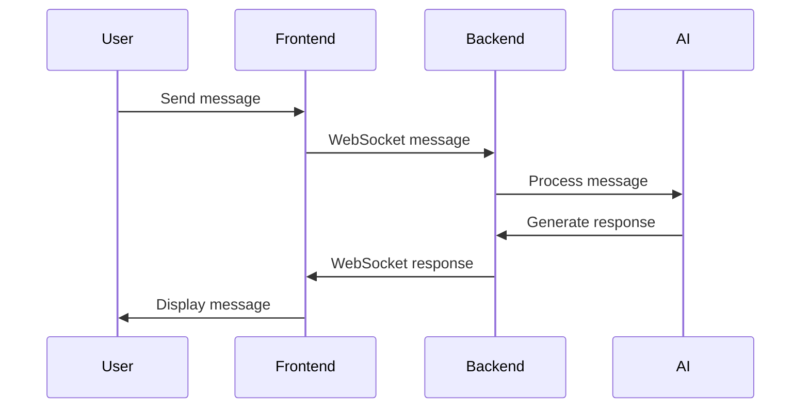

# file-chatting-app
# AI-Powered File Chat Application

A modern web application that combines file processing capabilities with AI-powered chat functionality. Built with FastAPI, React, and LangChain.

## Architecture Diagram



## Features

- 🔐 Secure Authentication with JWT
- 📱 Phone number verification using Twilio
- 💬 Real-time chat with AI using WebSockets
- 📄 File upload and processing
- 🤖 AI-powered conversations using LangChain
- 🎯 Modern, responsive UI

## Tech Stack

### Backend
- FastAPI (Python 3.12)
- PostgreSQL
- SQLAlchemy (ORM)
- Alembic (Migrations)
- LangChain (AI Processing)
- Twilio (SMS Verification)

### Frontend
- React 18
- Tailwind CSS
- Axios
- React Router
- WebSocket API

## Project Structure

```
project/
├── backend/
│   ├── alembic/
│   ├── auth/
│   │   ├── routes.py
│   │   ├── services.py
│   │   └── responses.py
│   ├── chat/
│   │   ├── models.py
│   │   ├── routers.py
│   │   ├── schemas.py
│   │   └── services.py
│   ├── core/
│   │   ├── config.py
│   │   └── security.py
│   ├── db/
│   │   ├── basemodel.py
│   │   └── session.py
│   ├── file_extraction/
│   │   ├── models.py
│   │   ├── routers.py
│   │   ├── schemas.py
│   │   └── services.py
│   ├── users/
│   │   ├── models.py
│   │   ├── routers.py
│   │   ├── schemas.py
│   │   └── services.py
│   ├── main.py
│   └── requirements.txt
│
├── frontend/
│   ├── public/
│   ├── src/
│   │   ├── components/
│   │   ├── context/
│   │   ├── pages/
│   │   ├── utils/
│   │   ├── App.js
│   │   └── index.js
│   ├── package.json
│   └── tailwind.config.js
│
├── .env.example
├── .gitignore
└── README.md
```

## Setup and Installation

### Prerequisites
- Python 3.12+
- Node.js 16+
- PostgreSQL 13+
- Twilio Account (for SMS verification)
- OpenAI API Key (for LangChain)

### Backend Setup

1. Create virtual environment:
```bash
python -m venv venv
source venv/bin/activate  # Unix
.\venv\Scripts\activate  # Windows
```

2. Install dependencies:
```bash
cd backend
pip install -r requirements.txt
```

3. Set up environment variables:
```bash
cp .env.example .env
# Edit .env with your configurations
```

4. Run database migrations:
```bash
alembic upgrade head
```

5. Start the server:
```bash
uvicorn main:app --reload
```

### Frontend Setup

1. Install dependencies:
```bash
cd frontend
npm install
```

2. Set up environment variables:
```bash
cp .env.example .env
# Edit .env with your configurations
```

3. Start the development server:
```bash
npm start
```

## API Documentation

### Authentication Endpoints

- POST `/auth/token` - Get access token
- POST `/auth/refresh` - Refresh access token
- POST `/users/register` - Register new user
- POST `/users/verify` - Verify phone number

### Chat Endpoints

- WebSocket `/chat/ws/{session_id}` - Chat connection
- POST `/chat/sessions` - Create new chat session
- GET `/chat/sessions` - List user's chat sessions
- GET `/chat/sessions/{session_id}` - Get chat history

### File Processing Endpoints

- POST `/file-extraction/upload/` - Upload file
- GET `/file-extraction/extracted-data/{user_id}` - Get extracted data

## Authentication Flow

1. User registration:


2. Authentication:


## WebSocket Chat Flow



## Deployment

### Backend Deployment (Example with Docker)

```dockerfile
FROM python:3.12-slim

WORKDIR /app
COPY requirements.txt .
RUN pip install -r requirements.txt
COPY . .

CMD ["uvicorn", "main:app", "--host", "0.0.0.0", "--port", "8000"]
```

### Frontend Deployment

```bash
# Build production bundle
npm run build

# Serve using nginx or other static file server
```

## Contributing

1. Fork the repository
2. Create a feature branch
3. Commit changes
4. Push to the branch
5. Create a Pull Request

## License

MIT License - see LICENSE.md

## Contact

For support or queries, please open an issue or contact aayushjain1475@gmail.com
